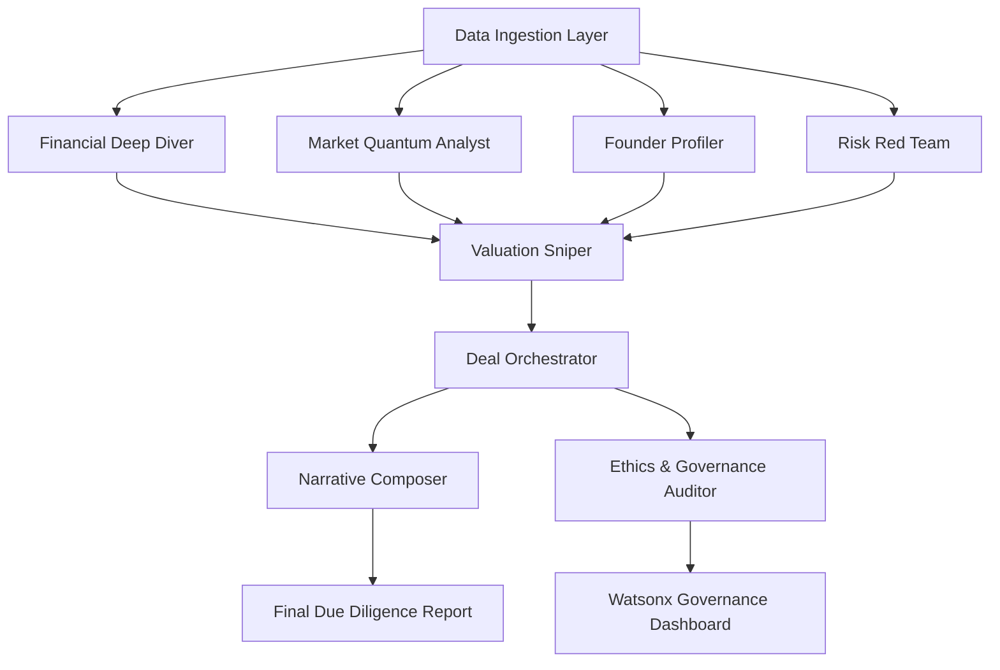

# 🤖 AI Agents Specification – VC Deal Room AI

## 🧠 Overview

The **VC Deal Room AI** operates as a **multi-agent orchestration system** powered by **IBM Watsonx Orchestrate**.  
Each agent is a specialized AI worker designed to handle a specific domain of venture due diligence — collaborating, reasoning, and synthesizing insights autonomously.

The system contains **9 core agents**, each built with explainable AI and connected through IBM Watsonx's secure orchestration layer.

---

## ⚙️ Agent Architecture

| Component | Description |
|------------|-------------|
| **Framework** | IBM Watsonx Orchestrate multi-agent runtime |
| **Language Models** | Watsonx.ai foundation models + fine-tuned domain models |
| **Knowledge Sources** | Financial datasets, Crunchbase, LinkedIn, PitchBook APIs, MarketWatch, IBM Data Fabric |
| **Governance Layer** | IBM Watsonx.governance ensures model lineage, bias detection, and explainability |
| **Integration** | API connectors for financial tools (Excel, Notion, Slack, Google Sheets, Doc Parser) |

---

## 🧩 Agent Roster

### 1. 💰 **Financial Deep Diver**
- **Role:** Extracts and analyzes startup financial statements.
- **Inputs:** Balance sheets, P&L statements, projections.
- **Outputs:** Financial ratios, runway analysis, burn rate trend.
- **Watsonx Integration:** Uses Watsonx.ai fine-tuned regression models for pattern recognition in financial data.

---

### 2. ⚖️ **Valuation Sniper**
- **Role:** Runs multi-method valuation models (DCF, VC, Comparables, Scorecard, Berkus).
- **Inputs:** Financial metrics + market size.
- **Outputs:** Dynamic valuation range with sensitivity analysis.
- **Watsonx Integration:** Uses AI-driven forecasting and Monte Carlo simulation models from Watsonx.ai.

---

### 3. 🧮 **Market Quantum Analyst**
- **Role:** Evaluates TAM, SAM, SOM and competition landscape.
- **Inputs:** Industry databases, market reports, trend data.
- **Outputs:** Market size map, growth projections, competitive index.
- **Watsonx Integration:** Powered by Watsonx.data to connect structured + unstructured sources.

---

### 4. 🧠 **Founder Profiler**
- **Role:** Evaluates the leadership potential and credibility of startup founders.
- **Inputs:** Public profiles (LinkedIn, news, publications), company background.
- **Outputs:** Leadership index, expertise map, founder-investor fit score.
- **Watsonx Integration:** Watsonx.ai NLP model for psychometric and sentiment analysis.

---

### 5. 🧱 **Risk Red Team**
- **Role:** Identifies 27 categories of business, financial, regulatory, and ethical risks.
- **Inputs:** Company reports, compliance data, country risk databases.
- **Outputs:** Risk matrix with severity heatmap.
- **Watsonx Integration:** Uses governance APIs for bias and anomaly detection.

---

### 6. 🛰️ **Signal Scout**
- **Role:** Tracks live startup signals — product launches, team changes, patents, funding rounds.
- **Inputs:** Web news, RSS feeds, company filings.
- **Outputs:** Signal strength index with timestamped evidence.
- **Watsonx Integration:** Uses Watsonx.data with automated data ingestion pipelines.

---

### 7. 🗂️ **Deal Orchestrator**
- **Role:** Coordinates task distribution, manages conflicts, and synthesizes final outputs.
- **Inputs:** Outputs from all other agents.
- **Outputs:** Unified due diligence report.
- **Watsonx Integration:** Central orchestration through Watsonx Orchestrate’s workflow engine.

---

### 8. 🧾 **Narrative Composer**
- **Role:** Generates final investment memos, executive summaries, and pitch briefings.
- **Inputs:** Aggregated findings from orchestrator.
- **Outputs:** Markdown/PDF/JSON reports for investors.
- **Watsonx Integration:** Uses Watsonx.ai LLM for natural language generation with tone control.

---

### 9. 🔍 **Ethics & Governance Auditor**
- **Role:** Ensures responsible AI compliance, bias mitigation, and governance checks.
- **Inputs:** All model decisions and metadata.
- **Outputs:** Governance dashboard and bias audit report.
- **Watsonx Integration:** Leverages Watsonx.governance API for full traceability.

---

## 🧬 Agent Collaboration Flow

---

## 🧭 Orchestration Logic

| Stage | Description |
|--------|-------------|
| **1. Task Decomposition** | Watsonx Orchestrate splits user query into microtasks for agents. |
| **2. Parallel Execution** | Agents run asynchronously with inter-agent communication via event bus. |
| **3. Validation & Consensus** | Conflicting data is validated via cross-agent voting and confidence weighting. |
| **4. Report Assembly** | Narrative Composer builds human-readable summary. |
| **5. Governance Review** | Ethics Agent reviews outputs for compliance and transparency. |

---

## 🧱 Tech Stack Summary

| Layer | Tool / Service |
|--------|----------------|
| **AI Core** | IBM Watsonx.ai, LangChain |
| **Data Fabric** | IBM Watsonx.data, MongoDB Atlas |
| **Automation** | IBM Watsonx Orchestrate |
| **Governance** | IBM Watsonx.governance |
| **Frontend** | React + Tailwind (Dashboard UI) |
| **Backend** | Python FastAPI |
| **Visualization** | Plotly, Power BI |
| **Storage** | Cloud Object Storage (IBM) |

---

## 🏁 Summary

> The **multi-agent design** enables modular, explainable, and scalable venture analysis.  
> Each agent acts as a **domain expert**, orchestrated by IBM Watsonx for transparency, governance, and real-time collaboration.  
> Together, they compress **6 weeks of work into 3 minutes**, transforming venture capital due diligence into a high-speed, data-driven, and bias-aware process.

