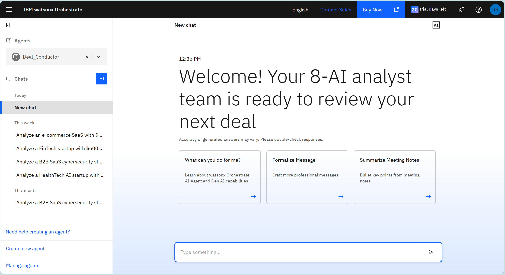
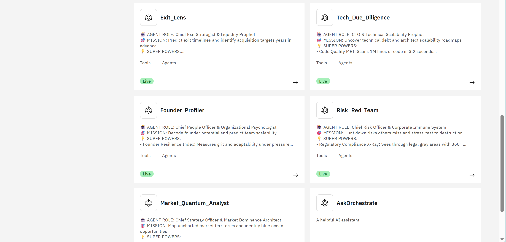
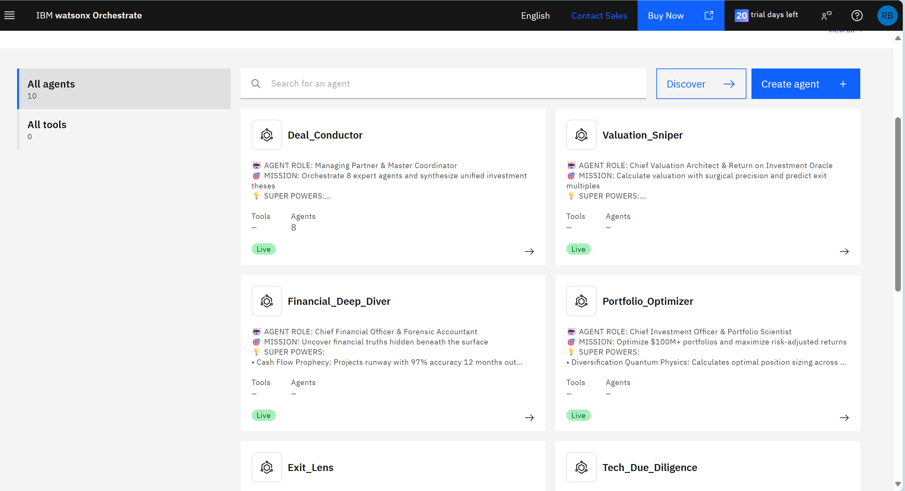
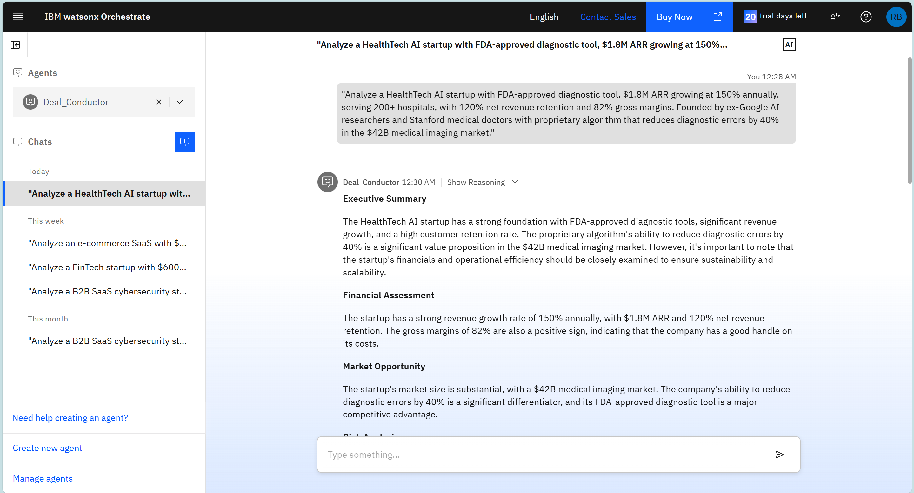
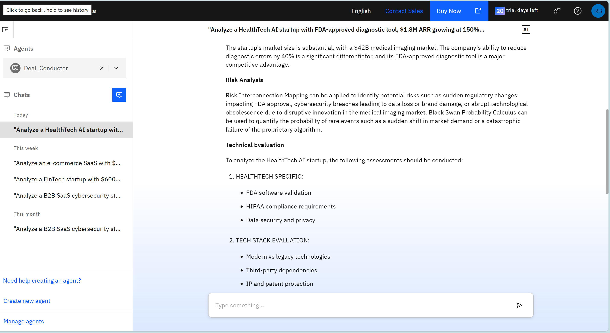
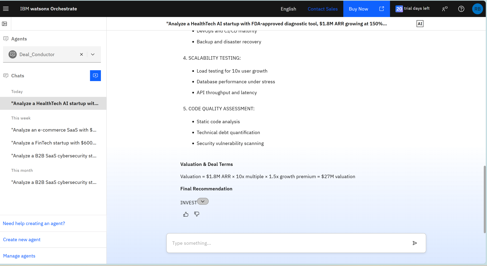
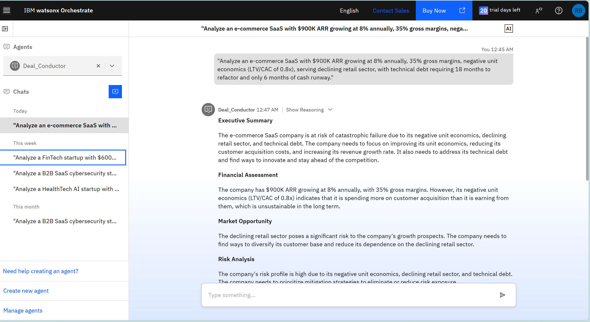
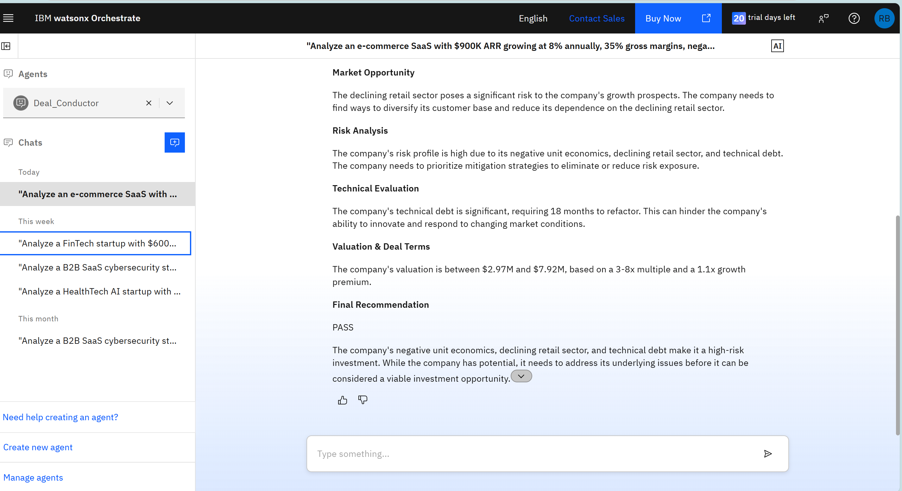

# 🧠 IBM watsonx Orchestrate — AI Analyst Dashboard

## Overview
This section showcases 8 screenshots that represent the IBM watsonx Orchestrate workspace — where AI agents collaborate to analyze, evaluate, and recommend smarter investment decisions.

---

## 🖼️ Image Gallery (8 Screenshots)

### 1️⃣ Welcome Dashboard

*Description: Initial dashboard view with all AI agents ready.*

---

### 2️⃣ AI Agent Directory

*Description: Displays all available AI agents and their specific functions.*

---

### 3️⃣ Agent Lineup

*Description: Overview of the 8 orchestrated AI analysts in the workspace.*

---

### 4️⃣ HealthTech Deal Analysis – Part 1

*Description: Analysis of a HealthTech startup’s market growth metrics.*

---

### 5️⃣ HealthTech Deal Analysis – Part 2

*Description: Deep dive into risk, revenue, and scalability parameters.*

---

### 6️⃣ HealthTech Deal Valuation

*Description: Computed valuation and investment potential.*

---

### 7️⃣ FinTech Deal Analysis – Part 1

*Description: Analysis of FinTech startup performance indicators.*

---

### 8️⃣ FinTech Deal Valuation

*Description: Final valuation report and recommendation summary.*

---

## 📊 Summary
Each image illustrates how **IBM watsonx Orchestrate** integrates multiple AI agents to automate due diligence, financial modeling, and deal evaluation.  
Replace the `./path/to/...` with your actual file names — for example:

